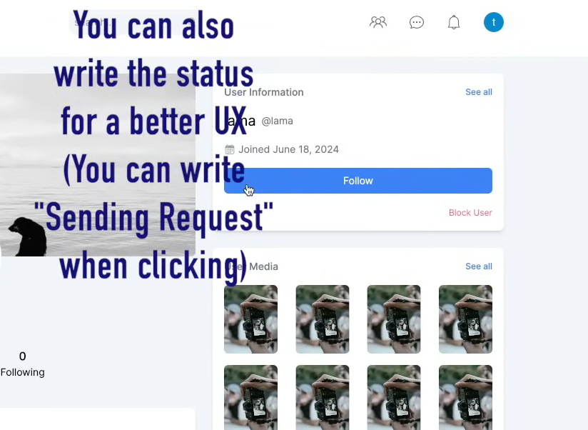

- stories show blue ring only when unviewed. so might need to create a view which contains an additional column if you have already viewed a person's story or not, or simply just add a new column or create a table. figure this out later.

- the user must see a different personal page for himself when the url params match with the one in auth();

- write loading state for the UI:

(optimistic hook)

- 