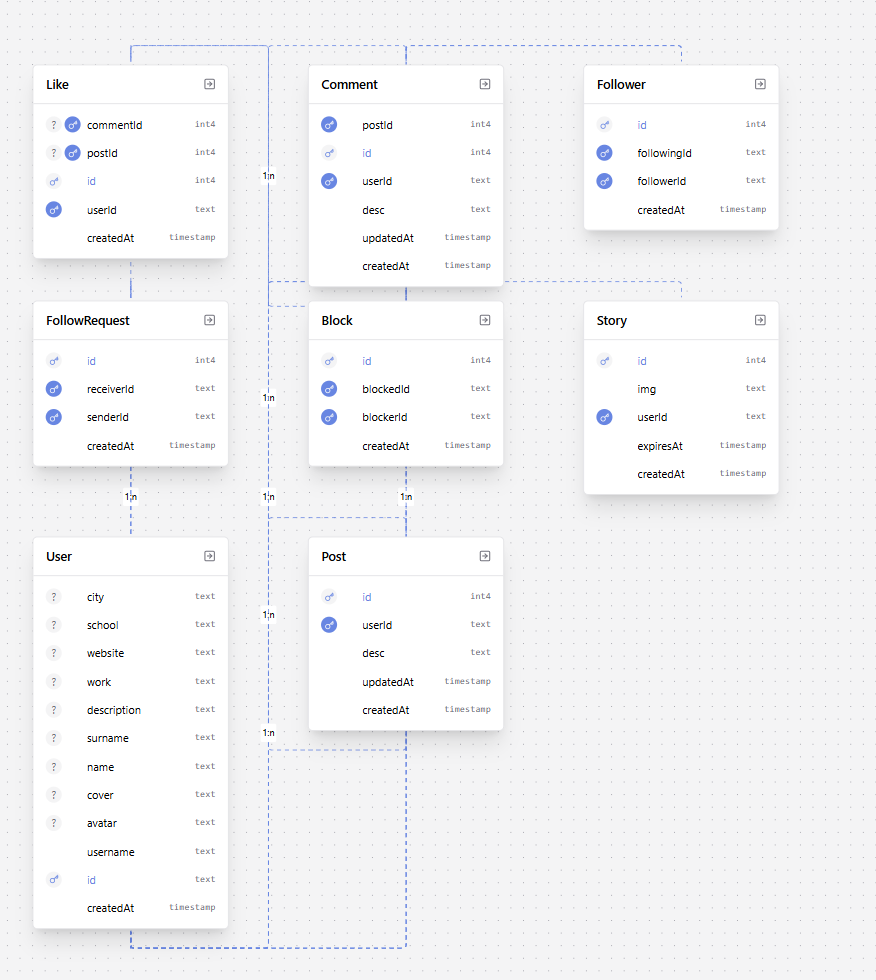
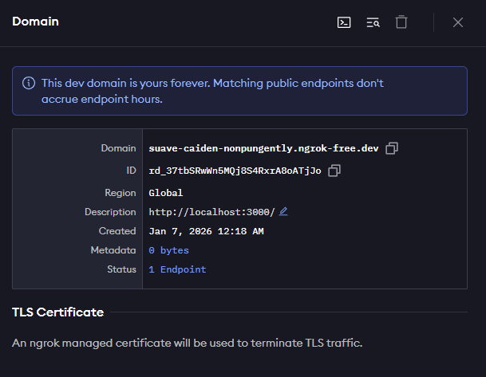
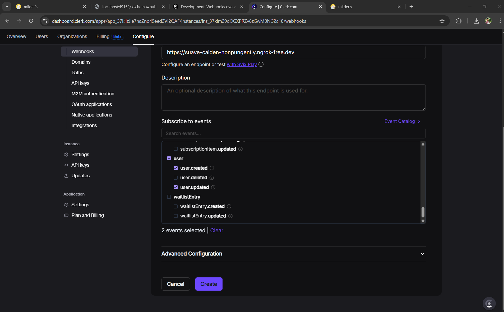
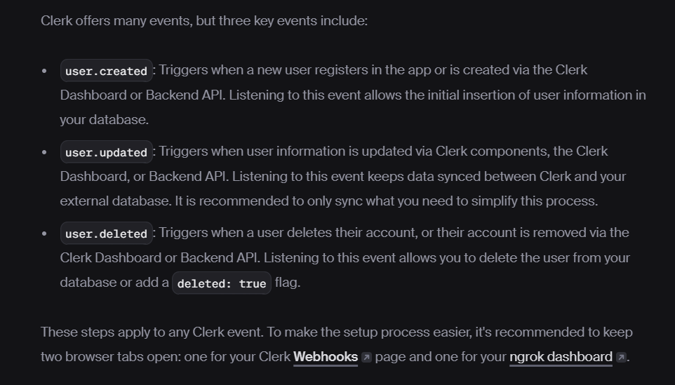

## this is how the schema looks like:



- when a user signs up using clerk, we will add him to the db. to do this, we use clerk webhooks. Goto the doc and search webhook waha pe.
- webhook se tumhe event notification milega.
- you go to webhook dashboard, there you click add endpoint. ab yaha you will add your domain url. but tum toh localhost pe chala rhe ho.
- we have some services available online which help you to give a domain url for your localhost.
- one such service is ngrok.

this is the site link i visited:
- [https://dashboard.ngrok.com/domains]("link to ngrok")

```cmd
ngrok http --url=suave-caiden-nonpungently.ngrok-free.dev 3000
```
this is the command i saw under `start an endpoint` section.

i also added http://localhost:3000 to description as follows:


once you have the url: mine is:  https://suave-caiden-nonpungently.ngrok-free.dev
add in the domain url in clerk webhook and select user.created and user.updated under user section so that event notifications are generated on either scnearios.


now come back to vs code. create under app folder: `api > webhooks > clerk` and here create route.ts
Henceforth, goto clerk dashboard, and edit the url: https://suave-caiden-nonpungently.ngrok-free.dev/api/webhooks/clerk

Okay, how to figure this entire thing out in the future because docs often do get updated, the above routes might not work in the future. hence, to discover them apply this logic:

1. what are we looking for?
we used clerk for auth purposes, hence we need webhooks to listen for user created and user updated events.
2. we want to create the webhook toh clerk docs me jaake webhook search kiye.
3. webhook me ek link tha webhook dashboard ka. clicked on that. then the dashboard opened up where i was needed to add a new api endpoint. but to create a new endpoint, we need to have a universal url for my endpoint. so for that, i used ngrok a free localhost to url service.
4. came back with a universal url and pasted it in the clerk dashboard, edited the url by adding /api/webhooks as vs code me route.ts is inside of api/webhooks/clerk
5. hamne ye sab isliye kiya kyuki hame chahiye tha ki user jab signup/update ho toh wo information db me store ho.. because we are not handling them ourselves. Auth ka code hamne khud nai likha hai.. External auth service use kiya hai. Hence, we can only know ki koi user create hua hai ya nai via the help of webhooks. This means ye sab scene isliye create hua because we wanted to keep our db in sync. so clerk ke webhook doc me syncing wala part padh lo.


doc me hii likha hua hai ngrok ke baare me. haha.

https://clerk.com/docs/guides/development/webhooks/syncing
the doc that contains all the work steps we wrote above.